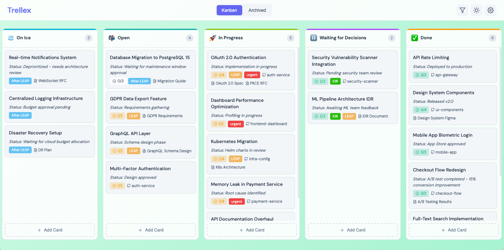

# Trellex - Lightweight Personal Kanban

A minimal, self-hosted Kanban board for personal task management. Built with Flask and vanilla JavaScript.



## Features

- **Kanban Board** - Drag and drop tickets between customizable lists
- **Ticket Management** - Title, description, status, tags, tasks checklist, repo/docs links
- **Archive System** - Archive completed tickets with easy restore
- **Light/Dark Mode** - Toggle between themes with automatic gradient adjustment
- **Customizable Themes** - 10 gradient presets per theme or custom colors
- **Tag Colors** - Assign colors to tags for visual organization
- **Filter by Tag** - Focus on specific tags across all lists
- **YAML Storage** - Human-readable data files for easy backup/editing
- **No Database Required** - All data stored in simple YAML files

## Quick Start

```bash
# Run with uv (recommended)
uv run python app.py

# Or with custom host/port
uv run python app.py --host 0.0.0.0 --port 8080
```

Open http://localhost:5000 in your browser.

## Command Line Options

```bash
python app.py [OPTIONS]

Options:
  -H, --host HOST   Host to bind to (default: 127.0.0.1, env: TRELLEX_HOST)
  -p, --port PORT   Port to bind to (default: 5000, env: TRELLEX_PORT)
  -d, --debug       Enable debug mode (default: false, env: TRELLEX_DEBUG)
```

### Environment Variables

You can also configure via environment variables:

```bash
export TRELLEX_HOST=0.0.0.0
export TRELLEX_PORT=8080
export TRELLEX_DEBUG=true
uv run python app.py
```

## Run as Background Service (macOS)

To run Trellex automatically in the background on macOS:

```bash
# Install as a background service (default: 127.0.0.1:5555)
./scripts/install-service.sh

# Or specify custom host and port
./scripts/install-service.sh 0.0.0.0 8080
```

### Service Management

```bash
# Stop the service
launchctl unload ~/Library/LaunchAgents/com.trellex.plist

# Start the service
launchctl load ~/Library/LaunchAgents/com.trellex.plist

# Restart service
launchctl unload ~/Library/LaunchAgents/com.trellex.plist && launchctl load ~/Library/LaunchAgents/com.trellex.plist

# View logs
tail -f logs/trellex.log

# View error logs
tail -f logs/trellex.error.log

# Uninstall the service
./scripts/uninstall-service.sh
```

The service will:
- Start automatically when you log in
- Restart automatically if it crashes
- Run in the background without a terminal window

## Alternative Setup

```bash
# Or create a virtual environment manually
uv venv
source .venv/bin/activate
uv pip install flask pyyaml
python app.py
```

## Project Structure

```
trellex/
├── app.py              # Flask app and API routes
├── pyproject.toml      # Project configuration (uv/pip)
├── data/
│   ├── config.yaml     # Lists, theme, and background settings
│   └── tickets.yaml    # All tickets data
├── logs/               # Log files (when running as service)
├── scripts/
│   ├── install-service.sh    # Install macOS background service
│   └── uninstall-service.sh  # Remove macOS background service
├── static/
│   ├── css/style.css   # Styling (light/dark themes)
│   └── js/
│       ├── app.js      # Main app logic
│       ├── kanban.js   # Board rendering
│       └── modal.js    # Modal handlers
└── templates/
    └── index.html      # Main HTML template
```

## Configuration

### Lists (config.yaml)
```yaml
lists:
  - id: "backlog"
    title: "Backlog"
    emoji: "📋"
    color: "#6366f1"

theme: "dark"  # or "light"

background:
  gradient_start: "#1e1b4b"
  gradient_end: "#0f172a"

tag_colors:
  urgent: "#ef4444"
  feature: "#6366f1"
```

### Tickets (tickets.yaml)
```yaml
tickets:
  - id: "ticket-001"
    title: "Example"
    status: "WIP"
    list_id: "backlog"
    tags: ["feature"]
    repo_links:
      - title: "my-repo"
        url: "https://github.com/user/my-repo"
    docs_links:
      - title: "Docs"
        url: "https://example.com/docs"
    tasks:
      - text: "Task 1"
        done: false
```

## Google Contacts Integration (Optional)

Trellex can integrate with Google Contacts to let you add contacts to tickets. This is especially useful for Google Workspace users to search their company directory.

### Setting Up Google Cloud

1. **Go to Google Cloud Console**
   - Visit: https://console.cloud.google.com/

2. **Create or Select a Project**
   - Click the project dropdown at the top
   - Create a new project or select an existing one

3. **Enable the People API**
   - Go to **APIs & Services** > **Library**
   - Search for "People API" and click **Enable**

4. **Configure OAuth Consent Screen**
   - Go to **APIs & Services** > **Credentials**
   - Create a new client
   - Select **Internal** (for Workspace) or **External**
   - Fill in the required fields (app name, support email)
   - Save and continue through the steps

5. **Create OAuth Credentials**
   - Go to **APIs & Services** > **Credentials**
   - Click **+ CREATE CREDENTIALS** > **OAuth client ID**
   - Application type: **Web application**
   - Name: "Trellex"
   - Under **Authorized redirect URIs**, add:
     ```
     http://127.0.0.1:5555/api/google/callback
     ```
     Change the port if you're using a different one!
   - Click **Create** and copy your **Client ID** and **Client Secret**

### Configure Trellex

Create a `.env` file in the project root:

```bash
GOOGLE_CLIENT_ID=your-client-id-here.apps.googleusercontent.com
GOOGLE_CLIENT_SECRET=your-client-secret-here
```

Or set environment variables directly:

```bash
export GOOGLE_CLIENT_ID="your-client-id-here.apps.googleusercontent.com"
export GOOGLE_CLIENT_SECRET="your-client-secret-here"
```

### Using Contacts

1. Start Trellex and open **Settings**
2. Click **Connect Google Account** in the Google Account section
3. Authorize the app when prompted
4. When editing tickets, use the **Contacts** field to search and add people
5. Toggle between **Directory** (company employees) and **All** (personal contacts too)
6. Click on a contact name to copy their email to clipboard

## Keyboard Shortcuts

- `Escape` - Close any open modal

